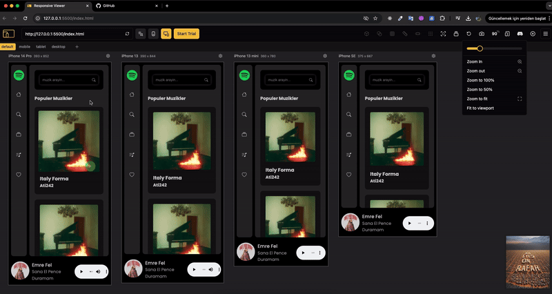

# 🎵 Spotify Clone Project

## 📋 **Project Overview**
This project is a dynamic and fully responsive Spotify clone website. Built using HTML, SCSS, Bootstrap framework, and JavaScript, the site allows users to search for artists or songs using Spotify's search API method and displays relevant results.

## 🔧 **Technologies Used**
- **HTML5**: For creating the structure of the webpage.
- **SCSS**: For advanced styling and maintainable CSS.
- **Bootstrap**: For responsive design and faster web development.
- **JavaScript (ES6+)**: For handling API requests and dynamic content.

## 🎯 **Project Objectives**
1. **API Integration**: Retrieve data from Spotify's search API.
2. **Search Functionality**: Enable users to search for artists or songs.
3. **Responsive Design**: Ensure optimal performance on all devices.
4. **Dynamic Content**: Display search results dynamically based on user input.
5. **User-Friendly Interface**: Provide a simple and easy-to-navigate design.

## 📂 **Project Structure**
- **Home Page (`index.html`)**: Provides the main interface with a search input.
- **JavaScript File (`main.js`)**: Handles API requests and displays search results.

## 🚀 **Usage**

### 💻 **Usage**
- **Search for Artists or Songs**: Use the search input to find specific artists or songs.
- **View Search Results**: See dynamically displayed search results based on your input.

## 🤝 **Contribution**
To contribute to this project, please open an issue first. Fork the repository, make your changes, and submit a pull request.

## 🎥 **Demo**
Here is a short GIF demonstrating the main features of the Spotify clone:

|

